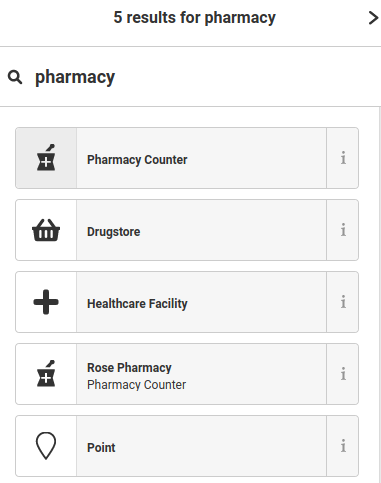
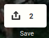

## Ano ang gagawin kung ang puesto o negosyo ay wala pa sa mapang 'Bukás pa rin'?

>
> Hindi mahanap ang iyong paboritong tindahan o botika sa 'Bukás pa rin'? Huwag mag-alala, sundin lang ang gabay na ito upang makatulong na mapagbuti ang aming pakikipagtulungan ng mga naa-access na mga lugar sa pag-confine.

Ang 'Bukás pa rin' ay datos na hango sa OpenStreetMap(OSM). Isipin na katulad ang konsepto nito sa "Wikipedia" pero para sa mapa: ang mapa ng buong mundo na maaari mong pag-yamanin batay sa iyong personal na kaalamang sa 'yong kapitbahayan.

At iyon nga ang gagawin natin: pag-husayin ang mapa upang mai-dagdag ang nawawalang puesto rito!

---

### Unang hakbang: lumikha ng isang account

Bago magsimula, kailangan mong lumikha ng isang account sa OpenStreetMap website.

Magrehistro lang sa [OpenStreetMap.org](https://osm.org/user/new)

Ang hakbang na ito ay mahalaga upang makasali sa komunidad, baguhin ang mapa, at makipag-ugnayan sa iba pang mga lokal na nag-aambag din.

### Pangalawang hakbang: baguhin ang mapa
Pagkatapos nito ay maaari kang mag-navigate sa OpenStreetMap.org habang nananatili itong bukas, o pumunta sa iba pang mga lugar upang galugarin ang iyong kapitbahayan.

Mag-zoom papunta sa kung saan nais mong magdagdag ng isang puesto, pagkatapos ay i-click ang **Edit** button sa gawing taas at kaliwa ng iyong screen

Sa unang pagkakataong gumamit ang OpenStreetMap, ipapaliwanag ng isang maikling gabay ang mga pangunahing bagay na kailangan mong malaman kung paano mag-ambag. Inirerekumenda namin na sundin mo ito hanggang sa wakas upang maging pamilyar sa proseso ng pag-aambag, ngunit kakailanganin lamang natin ang bahagi tungkol sa **Point** upang idagdag ang kulang o nawawalang puesto.

### Pangatlong hakbang: Lumikha ng puesto

Upang lumikha ng isang nawawalang puesto, i-click ang **Point**tool,  galawin ang mouse pointer at i-posisyon sa tamang lugar sa mapa, at i-click ang kaliwang pindutan ng mouse.

Pagkatapos, gamit ang patlang ng paghahanap sa kaliwa bahagi ng iyong screen, punan ang uri ng negosyo na nais mong likhain. Halimbawa, isang "pharmacy".

> **TIP**: Kung nais mong magdagdag ng isang franchised na negosyo o store chain, maaari mo ring hanapin ang tatak o marka nito (halimbawa "Mercury Drug" o "Jollibee") imbes ng pag-uuri sa kanila ("pharmacy", "fast food").

### Pang-apat na hakbang: magdagdag ng kapaki-pakinabang na impormasyon

Punan ang impormasyon tungkol sa puesto: tulad ng pangalan, address o telepono.

Hindi mo kailangang punan ang lahat ng patlang sa form: kung hindi mo maalala ang pangalan ng restawran, ok lang na laktawan itong. (Huwag isulat na "blangko".)

### Pang-limang hakbang: i-save ang iyong mga pagbabago

Kapag tapos ka na, ang kailangan mo lang gawin ay i-save ang mga pagbabago sa pamamagitan ng pag-click sa Save button sa kanang bahagi ng tuktok ng screen

Magdagdag ng isang maikling komento upang ipahiwatig kung ano ang nag-bago sa mapa, pagkatapos ay i-click ang "Upload" button.

### 'Yan na 'yun!

Binabati kita sa una mong kontribusyon, at maligayang pagdating sa komunidad ng OpenStreetMap!

Ngayon, ang kailangan mo lang gawin ay maghintay: ang mga bagong puesto ay regular na idinagdag at otomatiko sa mapang  'Bukás pa rin'. Pagkatapos nito ay maaari ng ipahiwatig ang anumang karagdagang impormasyon na kapaki-pakinabang habang may kuwarentenas, nang direkta sa wesite.

##### Ilang karagdagang mga puna

Bago mo likhain ang kulang na puesto, maingat na suriin ang iba pang mga naka-mapa na sa lugar: maaaring nandoon na ito, ngunit may ibang pagka-uri!

Ang OpenStreetMap ay isang pam-publikong mapa: huwag magdagdag ng anumang personal na datos tungkol sa iyong sarili o sa mga mangangalakal na idinagdag mo.

Huwag kumopya ng impormasyon mula sa iba pang mga mapa, na karaniwang protektado ng copyright.

##### Kailangan mo ng tulong?

Kung mahirapan ka man sa pagdaragdag ng datos o may mga katanungan pa, huwag mag-atubiling sipatin ang iba't ibang [mga channel ng komunikasyon ng mga komunidad ng OpenStreetMap sa Pilipinas](http://osm.org/wiki/ph) - ang [LoCo channel](https://t.me/OSMph) ay ang pinaka-aktibo, at ang mga kasama nating boluntaryo ay matutuwang tulungan ka sa iyong mga katanungan.

Kami ay umaasa sa iyo at sa iyong lokal na kaalaman sa'yong kapitbahayan upang lumikha ng pinakamahusay na mapa sa mundo at positibong makisama sa pag-gawa nitong panahon ng Covid-19, at pagka-natapos pa nito.
